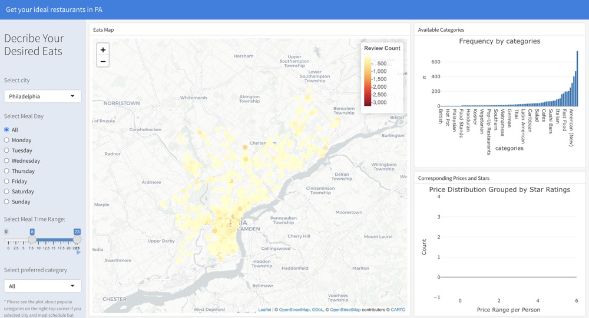

## **Motivation**
The aim of our project is to explore the relationship between restaurant pricing and customer ratings, and its reflection on the food culture and economic diversity of the city. Understanding the correlation between restaurant pricing and customer ratings has become critical as consumers demand more in terms of dietary choices and quality of life. We plan to analyze regional restaurant data to reveal potential patterns between price ranges and customer ratings, thereby providing the restaurant industry with a reference point for optimizing pricing and service enhancement.

## **Related Work**
We are inspired by a large body of research on the relationship between consumer behavior and commercial pricing. For example, certain studies suggest that high pricing may imply high quality, but in practice, consumer ratings may focus more on service experience and dining quality than on price. These studies emphasize the importance of analyzing price in conjunction with reviews. By integrating data from platforms such as Yelp, our project attempts to systematically analyze the relationship between price ranges and ratings of restaurants in the region, further enriching research in this area.


## **Initial Questions**
The purpose of this project is to answer the following question:

- Is there a significant correlation between a restaurant's price range and customer ratings?

- Can we reveal patterns in the cultural and economic diversity of urban food from price and rating datasets?

- Through visualization and interactive tools, how can we help users quickly understand the distribution of prices and ratings of restaurants in different areas and choose the most compatible restaurant?

## **Data**
### **Source**
  The data for this project was obtained from [Yelp's Open Dataset](https://www.yelp.com/dataset) as JSON files which contain `150,346` stores including diverse types of shops and restaurants. Yelp provides detailed `58` variables on businesses, including restaurants, their locations, ratings, reviews, and various attributes like dog allows and price range. While the dataset does not include New York data, it provides comprehensive coverage of other regions, including PA.

### **Scraping Method**
  Initially, we planned to use the Yelp Fusion API to retrieve data, as it allows access to Yelp’s business information programmatically. However, the detailed datasets and larger limits we required were cost-prohibitive. Instead, we used the [Yelp's Open Dataset](https://www.yelp.com/dataset). While this dataset did not include New York data, we decided to focus on Southeastern Pennsylvania, a region with a large number of observations and close to where Angel’s friend lives.
As we explored the data further, we found that it included 228 cities and townships. To enhance the analysis, we narrowed the scope to counties, merging the data with county information obtained from the [United States zip codes ](https://www.unitedstateszipcodes.org/pa/). This allowed us to provide a clearer geographic perspective.

### **Data Cleaning**
The data cleaning process involved multiple steps to ensure accuracy, consistency, and relevance:

- **Removing Irrelevant Entries**:  
  Yelp’s dataset contains various types of businesses, including non-restaurant establishments. We filtered the data to focus only on restaurants and removed irrelevant categories.

- **Geographic Normalization**:  
  Standardized city and county names for consistency by lowercase, such as converting variations like "Phila" to "Philadelphia."  

- **Handling Erroneous Values**:  
  Corrected anomalies in the data, such as fixing incorrect ZIP codes (e.g., changing 10426 to 19426).

- **Filtering by Counties**:  
  To simplify analysis, we merged data based on county boundaries using ZIP code data and focused on five counties in Southeastern Pennsylvania: Philadelphia, Delaware, Montgomery, Chester, and Bucks.
  
### **Final Dataset**
The final dataset contains 7,801 observations and includes key variables such as:

- **Location Information**: `city`, `county`, `postal_code`, `longitude`, and `latitude.`
- **Restaurant Attributes**: `Star`, `review_count`, `categories`, `price range`, and additional features like `delivery` or `takeout` availability.
- **Hours of Operation**: `Everyday Hours`, `Weekday/Weekend hours`, and `Total hours`.

---
title: "Model Building"
output:
  html_document:
    code_folding: hide
    toc: true
    toc_float: true
---
```{r setup, include=FALSE}
knitr::opts_chunk$set(
  echo = TRUE,    
  warning = FALSE,
  message = FALSE   
)

```

```{r load-packages, message=FALSE, warning=FALSE}

library(dplyr)
library(ggplot2)
library(tidyr)
library(janitor)
library(plotly)
library(sf)
library(broom)
load("data/PAhour.rdata")
```

### **Basic analysis**

In the third question, after examining the relationship between price and ratings, we wanted to learn more about other factors that influence restaurant popularity. This time, instead of using only the number of reviews or the star rating, we combined them and assigned different weights to the “popularity_score”. We weighted the star rating down to 0.3 and the review count to 0.7, which reduces the impact of the problem we mentioned in Q1 that a low number of reviews can make the score inaccurate. another reason for the review count to be more weighted is that it reflects how many people are willing to go to the restaurant and leave a review, which is a much better indicator of the popularity of the restaurant than the star rating. This is a better indicator of a restaurant's popularity than star ratings. 

```{r}
min_restaurants <- 5
filtered_data <- PAhour %>%
  group_by(city) %>%
  filter(n() >= min_restaurants) %>%
  ungroup()
filtered_data <- filtered_data %>%
  mutate(popularity_score = 0.3 * stars + 0.7 * review_count)
```

### **Model building and Selection**

At the beginning, we built separate linear models for more than ten characters, one of which is shown in the figure below, and when we saw the results, we realized that it did not accurately reflect the relationship between popular score and character.

```{r}
filtered_data$attributes$BusinessAcceptsCreditCards <- tolower(filtered_data$attributes$BusinessAcceptsCreditCards)
filtered_data$accepts_credit_cards <- ifelse(filtered_data$attributes$BusinessAcceptsCreditCards == "true", 1, 0)

credit_card_popularity_model <- lm(popularity_score ~ accepts_credit_cards, data = filtered_data)

credit_card_popularity_model|>
  tidy() %>%
  knitr::kable(digits = 3)

qqnorm(residuals(credit_card_popularity_model), main = "QQ Plot: Credit Card Popularity Model")
qqline(residuals(credit_card_popularity_model), col = "red")

```

### **Reflection and improvement**

We considered the possibility that popular_score was heavily skewed (e.g., many values were very low and a few were very high), so we re-modeled using a logarithmic transformation, and this time we were much more satisfied with the results.

After the creation of the new model we found that the following factors have a significant effect on the popularity of the restaurant: BusinessAcceptsCreditCards, Delivery, OutdoorSeating, Reservations, weekday business and weekend business. Upon further exploration, we found the fact that the effect of weekday business and weekend business on the popularity of a restaurant was significant but not relevant to our analysis. The prerequisite for a restaurant to be popular is that it is open for a long time, and people can't rate a restaurant that is not open, so we excluded the factor of business hours from our model.


```{r}
filtered_data$weekday_hours <- as.numeric(filtered_data$Weekday_hours)
filtered_data$weekend_hours <- as.numeric(filtered_data$Weekend_hours)
hours_popularity_model <- lm(log(popularity_score+1) ~ weekday_hours + weekend_hours, data = filtered_data)


qqnorm(residuals(hours_popularity_model), main = "QQ Plot: Hours Popularity Model")
qqline(residuals(hours_popularity_model), col = "red")

hours_popularity_model|>
  tidy() %>%
  knitr::kable(digits = 3)
```

### **FINAL MODEL**

So this is our final model. There are some many characteristic will influence the popularity of the restaurants.
From the result of our model, we can see that the p-value of BusinessAcceptsCreditCards,Delivery,OutdoorSeating, and Reservations are smaller than 0.05. So they are the important characteristic that will influence the popularity of the Restaurant. It is also interesting to note that the popularity of restaurants that accept credit cards for purchases seems to have declined. We suspect that this may be due to the fact that more restaurants in the data do not accept credit cards, making the data somewhat inaccurate. Of course, from a real-life perspective, not overspending and not using credit cards may also help us develop better spending habits.
ALl in all, as regional differences play a significant role in determining popular foods and restaurant characteristics. Tailoring offerings to local preferences and ensuring convenience-focused features like delivery and  provide reservation service for customer can positively impact restaurant popularity.

```{r}
filtered_data$attributes$RestaurantsTakeOut <- tolower(filtered_data$attributes$RestaurantsTakeOut)
filtered_data <- filtered_data %>%
  mutate(
    ByAppointmentOnly = ifelse(tolower(attributes$ByAppointmentOnly) == "true", 1, 0),
    BusinessAcceptsCreditCards = ifelse(tolower(attributes$BusinessAcceptsCreditCards) == "true", 1, 0),
    Delivery = ifelse(tolower(attributes$RestaurantsDelivery) == "true", 1, 0),
    BusinessParking = ifelse(!is.na(attributes$BusinessParking) != "none", 1, 0),
    OutdoorSeating = ifelse(tolower(attributes$OutdoorSeating) == "true", 1, 0),
    Reservations = ifelse(tolower(attributes$RestaurantsReservations) == "true", 1, 0),
    WheelchairAccessible  = ifelse(filtered_data$attributes$WheelchairAccessible == "true", 1, 0),
    RestaurantsTakeOut  = ifelse(filtered_data$attributes$RestaurantsTakeOut == "true", 1, 0),
  )
# Fit the multiple linear regression model
multiple_model <- lm(
  log(popularity_score + 1) ~ ByAppointmentOnly + BusinessAcceptsCreditCards +RestaurantsTakeOut+ Delivery + OutdoorSeating + Reservations,
  data = filtered_data
)
```


```{r}
multiple_model|>
  tidy() %>%
  knitr::kable(digits = 3)
```

### **QQ Plot of Residuals**

We can see from the qq plot that the model fit is not bad. 

```{r}
qqnorm(residuals(multiple_model), main = "QQ Plot of Residuals")
qqline(residuals(multiple_model), col = "red")

plot(multiple_model, which = 1, main = "Residuals vs Fitted")
```


## **R shiny App to choose the most compatible restaurant**
We developed an R Shiny application to help users explore restaurants in Pennsylvania based on their preferences, including city, meal day, time range, category, price range, and stars. Users can interact with the app by selecting specific criteria to generate a tailored visualization of restaurant data. The app integrates various visualizations, including:

- **Map Visualization**: Displays restaurant locations within the selected city. Color intensity reflects the number of reviews, allowing users to gauge popularity by geographic area.

- **Category Frequency**: Shows the distribution of restaurant categories across the city, enabling users to identify popular cuisines.

- **Price and Rating Distribution**: Highlights the relationship between price range and star ratings. Users can see the distribution of restaurants grouped by star ratings and price per person.

Below is a screenshot to illustrate it.



