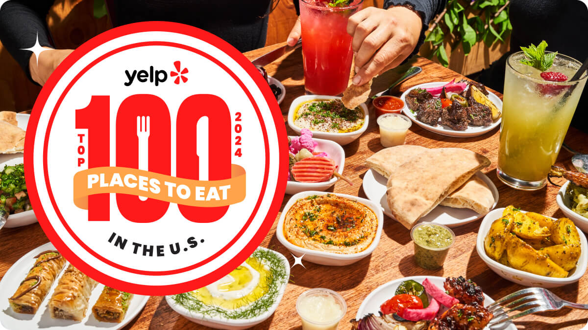

```{r setup, include = FALSE}
library(tidyverse)
library(ggplot2)
library(plotly)
library(tigris)
library(sf) 
```

```{r, include = FALSE}
load("data/mergedPA.RData")
pa_counties <- counties(state = "PA", class = "sf") |>
  filter(NAME %in% c("Philadelphia", "Delaware", "Montgomery", "Chester", "Bucks"))
```

---


Photo from:  https://www.yelp.com/article/top-100-us-restaurants-2024/ 

It is hard for anyone to find a good restaurant, no matter if they stay in the same place for a long time or just move in like us. When people do not know where to eat, rating apps such as yelp would be a key resource for people to use. However, it led to an interesting question to us: what factors could correlate with rates or stars. 

---

## Project Overview
<iframe width="560" height="315" 
        src="https://www.youtube.com/embed/dQw4w9WgXcQ" 
        title="YouTube video player" 
        frameborder="0" 
        allow="accelerometer; autoplay; clipboard-write; encrypted-media; gyroscope; picture-in-picture; web-share" 
        allowfullscreen>
</iframe>

---

## Restaurant Around Southeastern PA
The map shows that most restaurants in Southeastern Pennsylvania are clustered around Philadelphia, reflecting its status as a densely populated urban center. The majority of ratings are green, indicating an average star rating around 4. Suburban counties like Montgomery and Bucks also have notable restaurant density, but their distribution is more spread out compared to the concentrated clusters in Philadelphia.

```{r, fig.width = 10, fig.asp = 0.8, warning=FALSE}
ggplot() +
  geom_sf(data = pa_counties, color = "black", fill = "lightgrey", size = 0.8) + 
  geom_point(
    data = mergedPA,
    aes(x = longitude, y = latitude, color = stars),
    size = 0.5, alpha = 0.5
  ) +  
  geom_sf_text(
    data = pa_counties,
    aes(label = NAME),
    size = 3, color = "black", fontface = "bold"
  ) +  
  coord_sf(xlim = c(-76, -74.5), ylim = c(39.7, 40.5), expand = FALSE) + 
  theme_void(base_size = 15) +
  theme(
    legend.position = "bottom",
    plot.title = element_text(hjust = 0.5, size = 16)
  ) +
  guides(color = guide_colorbar(
    title.position = "top",
    barwidth = 15,
    barheight = 0.5
  )) +
  scale_color_viridis_c(option = "D", name = "Stars") + 
  labs(
    title = "Restaurant Ratings in Southeastern Pennsylvania (By County)",
    color = "Stars"
  )
```


### Looking for some fantastic food?
### Looking for fancy places to eat for date?
### Looking for a match for special needs?
**Try our [App](https://yt4617.shinyapps.io/shiny_dashboard_template/) to get your ideal restaurant in PA !**


---


For more informartion about yelp.data and some nice restaurant, check out https://www.yelp.com/dataset